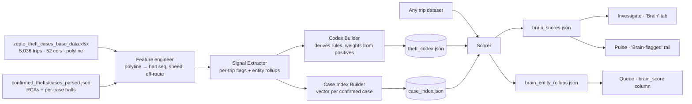
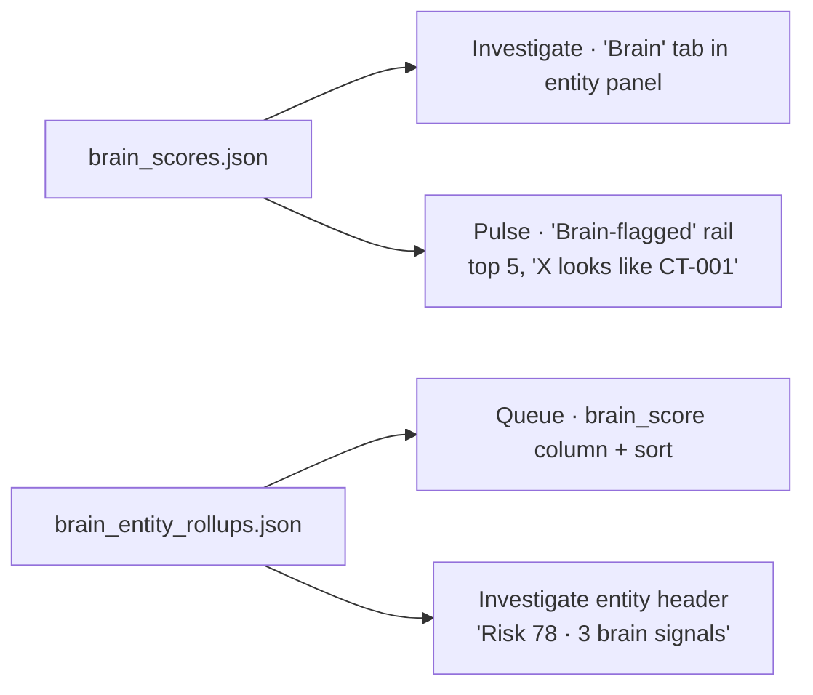

# Zepto Theft Brain — Pattern Codex + Classifier Engine

**Date:** 2026-05-30
**Author:** Arjun Hariharan (FT product)
**Status:** Approved for implementation
**Scope:** Sub-projects #1 (Pattern Codex) + #2 (Classifier Engine) bundled.
**Out of scope (later specs):** Vector RAG with embeddings, dedicated UI codex-management page, multi-tenant federation.

---

## 1. Goal in one line

Mine confirmed thefts + blacklisted entities into an **auditable codex of patterns** with case-grade narrative, scored against any trip dataset, surfaced inside the existing Zepto pages — no new top-level nav, no ML black box.

**Mode:** forensic only (score completed trips).
**Why hybrid (codex + case retrieval):** the codex is leadership-defensible (human-readable rules with weights and case citations); case retrieval is the storyline ("this trip looks like CT-001"). Customer's DS team can build a model — they cannot ship an editable rule-set with case provenance in this cycle.

---

## 2. Data flow



---

## 3. Module layout

```
stoppage-intelligence/
  brain/
    __init__.py
    features.py        # polyline → halt seq, speed segments, off-route, time-of-day
    signals.py         # one function per signal definition
    codex_builder.py   # mines positive-class stats → theft_codex.json
    case_index.py      # builds case_index.json
    scorer.py          # apply codex + case retrieval → brain_scores.json + rollups
    build_brain.py     # CLI entry point
  tests/brain/
    test_features.py
    test_signals.py
    test_scorer.py
```

**Single CLI:** `python -m brain.build_brain` writes outputs to `frontend/public/zepto/brain/`. No new services, no streaming, no infra changes.

**Inputs (existing files):**
- `zepto_theft_cases_base_data.xlsx` (training set — 5,036 trips × 52 cols, polylines, blacklist context)
- `confirmed_thefts/cases_parsed.json` (per-case RCAs + halts)
- `Feb_May_Zepto_trips_with_poi.csv` (target dataset to score)

**Outputs (new):** `theft_codex.json`, `case_index.json`, `brain_scores.json`, `brain_entity_rollups.json`.

---

## 4. Signal taxonomy

```mermaid
graph TD
    SIG[Codex signals] --> P[ping_pattern]
    SIG --> H[halt_signature]
    SIG --> E[entity_state]
    SIG --> T[temporal]
    SIG --> G[geofence]
    SIG --> R[closure_anomaly]

    P --> P1[off-route detour > X km]
    P --> P2[ping gap > Y min mid-trip]
    P --> P3[low ping density per km]

    H --> H1[gate-pretext halt near origin]
    H --> H2[long halt at non-logistics POI]
    H --> H3[multi-halt cluster within 5km]

    E --> E1[driver in blacklist]
    E --> E2[vehicle in blacklist]
    E --> E3[transporter repeat-offender]
    E --> E4[blacklist contagion: shared route/halt with blacklisted entity]

    T --> T1[night-share > threshold]
    T --> T2[gate-out → first ping > X min]

    G --> G1[geofence_breached == true]
    G --> G2[transit_distance >> google_distance]
    G --> G3[destination_entry missing]

    R --> R1[auto-closure AND total_pings < N]
    R --> R2[unloading_time_hrs < 0.1]
```



Each leaf becomes one signal entry. Weight + threshold are derived from `training_hit_rate` vs `false_match_proxy`, where:

- `training_hit_rate` = share of positive-class trips (confirmed theft + blacklisted-entity trips in `zepto_theft_cases_base_data.xlsx`) for which the signal fires.
- `false_match_proxy` = share of trips in `Feb_May_Zepto_trips_with_poi.csv` *not* present in the positive set for which the signal fires.
- `weight = round(100 * (training_hit_rate - false_match_proxy))`, floored at 0. Signals with weight < 5 are dropped from the codex.

---

## 5. Codex schema (`theft_codex.json`)

```json
{
  "version": "2026-05-30.1",
  "generated_at": "2026-05-30T14:30:00",
  "training_set": {
    "confirmed_thefts": 13,
    "blacklisted_drivers": 27,
    "blacklisted_vehicles": 19,
    "total_positive_trips": 5036
  },
  "signals": [
    {
      "id": "S-07",
      "name": "Gate-pretext halt near origin",
      "category": "halt_signature",
      "definition": "halt_duration_hrs >= 0.5 AND nearest_poi_type == 'gate' AND distance_to_poi_km < 0.25 AND distance_from_origin_km < 5",
      "rationale": "CT-001: driver stalled at 'gate' POI minutes after origin exit — cover for cabin concealment / handover.",
      "weight": 25,
      "training_hit_rate": 0.62,
      "false_match_proxy": 0.08,
      "source_cases": ["CT-001", "CT-004"],
      "min_evidence_pings": 3
    }
  ]
}
```

**Codex is human-editable.** An analyst can adjust a weight or disable a signal without code changes — that is the auditable-brain pitch.

---

## 6. Case index (`case_index.json`)

```json
{
  "version": "2026-05-30.1",
  "cases": [
    {
      "case_id": "CT-001",
      "type": "confirmed_theft",
      "city": "Lucknow",
      "vehicle": "UP32QT2997",
      "transporter": "A&A",
      "loss_inr": 51924,
      "rca_summary": "driver handover + cabin concealment, gutkha",
      "signature_vector": {
        "halt_count_per_100km": 2.4,
        "max_halt_hrs": 1.25,
        "non_logistics_halt_share": 0.85,
        "night_share": 0.0,
        "off_route_km": 12.3,
        "ping_gap_max_min": 18,
        "gate_pretext_halts": 2,
        "blacklisted_entity_match": 1.0,
        "transporter_freq_in_codex_hits": 0.34
      },
      "matched_signals_on_self": ["S-07", "S-11", "S-23"]
    }
  ]
}
```

10–12 numeric features per case. Distance = weighted Euclidean over min-max-normalised features. **Feature weight = sum of codex `weight` values for signals whose definition references that feature** (e.g. `max_halt_hrs` accumulates weight from every halt-duration signal). No embeddings library, no ML dependency — numpy only.

`similarity` returned in `brain_scores.json` is `1 - (distance / max_distance_in_index)`, clamped to `[0, 1]`.

---

## 7. Scoring algorithm

```mermaid
sequenceDiagram
    participant T as Trip
    participant FE as features.py
    participant SC as scorer.py
    participant CX as theft_codex.json
    participant CI as case_index.json
    participant OUT as brain_scores.json

    T->>FE: raw row + polyline
    FE->>FE: derive halt seq, off-route, ping stats
    FE->>SC: feature dict
    SC->>CX: load signals
    loop each signal
        SC->>SC: evaluate definition → fires?
        alt fires
            SC->>SC: score += weight; matched.append(id)
        end
    end
    SC->>CI: build trip signature vector
    loop each case
        SC->>SC: distance = weighted_euclidean(trip_vec, case_vec)
    end
    SC->>SC: top_3 = nearest cases
    SC->>OUT: {trip_id, score, matched_signals, top_3_cases}
```

**Tier mapping:** `score >= 70 → high`, `40–69 → medium`, `< 40 → low`. Tiers feed Pulse rail and Queue colour.

---

## 8. Output contract (`brain_scores.json`)

```json
{
  "trip_id": "54223023",
  "brain_score": 87,
  "tier": "high",
  "matched_signals": [
    {
      "id": "S-07",
      "name": "Gate-pretext halt near origin",
      "weight": 25,
      "evidence": {"halt_ts": "2026-04-01T09:21:29", "poi_distance_km": 0.17}
    }
  ],
  "similar_cases": [
    {
      "case_id": "CT-001",
      "similarity": 0.87,
      "shared_signals": ["S-07", "S-11"],
      "narrative": "Same gate-pretext + same transporter cluster"
    }
  ],
  "recommended_action": "Open case packet · cross-check against CT-001 driver Suraj 7459901375"
}
```

`brain_entity_rollups.json` — same structure but keyed by `driver_number`, `vehicle_number_clean`, `transporter`, with `risk_score`, `top_signal_ids`, `trips_with_brain_hit`.

---

## 9. UI integration



**Investigate "Brain" tab (inside entity panel):**
- Top: score + tier chip + recommended-action button.
- Middle: matched-signal chips; click → evidence drawer (halt ts, POI, distance, weight).
- Bottom: 2-up case comparison — current trip polyline left, nearest case right, shared signals highlighted.

**No new top-level nav.** All three inserts reuse existing shadcn/ui components and the locked token scale (per `ui-system-rules`).

---

## 10. Testing (sanity, not exhaustive)

```
tests/brain/
  test_features.py   # polyline decode + halt sequence vs hand-computed fixture
  test_signals.py    # every confirmed-theft trip must self-match ≥1 signal from its source case
  test_scorer.py     # leave-one-out: top-1 nearest case for a held-out theft trip must be the same case_id it came from
```

Self-recall and leave-one-out are the minimum bar. No ROC, no train/test split heroics — this is a deterministic codex with case-grade narrative, not a model claim.

---

## 11. Failure modes

| Risk | Mitigation |
|---|---|
| Signal over-fits a single case | `source_cases` field forces ≥2 cases before a signal ships with weight > 10. |
| Codex drifts as new cases land | Codex is versioned (`version` field). Rebuild is one CLI call. |
| Case index dominated by one transporter | Per-transporter cap in case retrieval (max 2 cases from same transporter in top-3). |
| Frontend reads stale JSON | `version` field surfaced in Investigate footer so analyst knows codex date. |
| Polyline missing (18.2% of trips) | Fall back to halt/closure/entity signals only; flag `polyline_available: false` in output. |

---

## 12. What we explicitly do NOT build in v1

- Vector embeddings (numpy weighted Euclidean is enough at this scale).
- A dedicated codex-management UI page (codex JSON is hand-editable; later spec).
- Live / streaming scoring (forensic only).
- Multi-tenant federation (Zepto-only codex; JSW gets its own later).
- ML overlay on top of the rules.

Each of these is a separate later spec.
