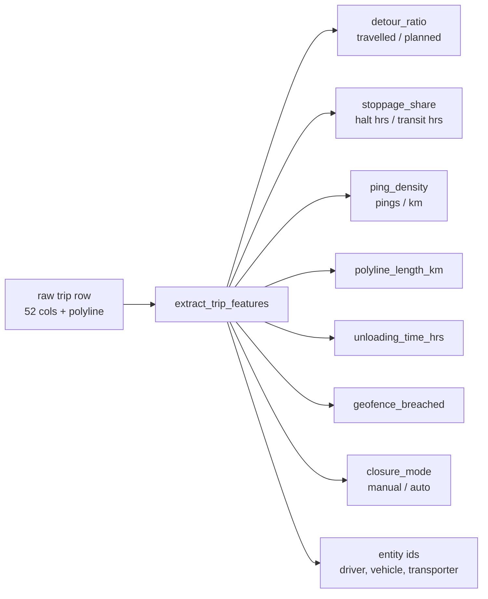
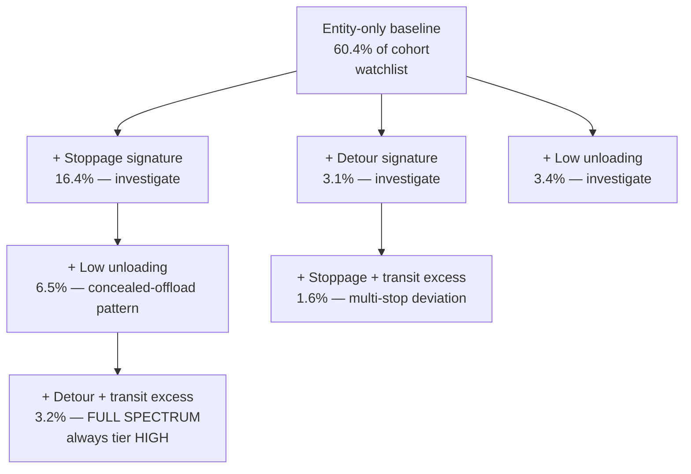
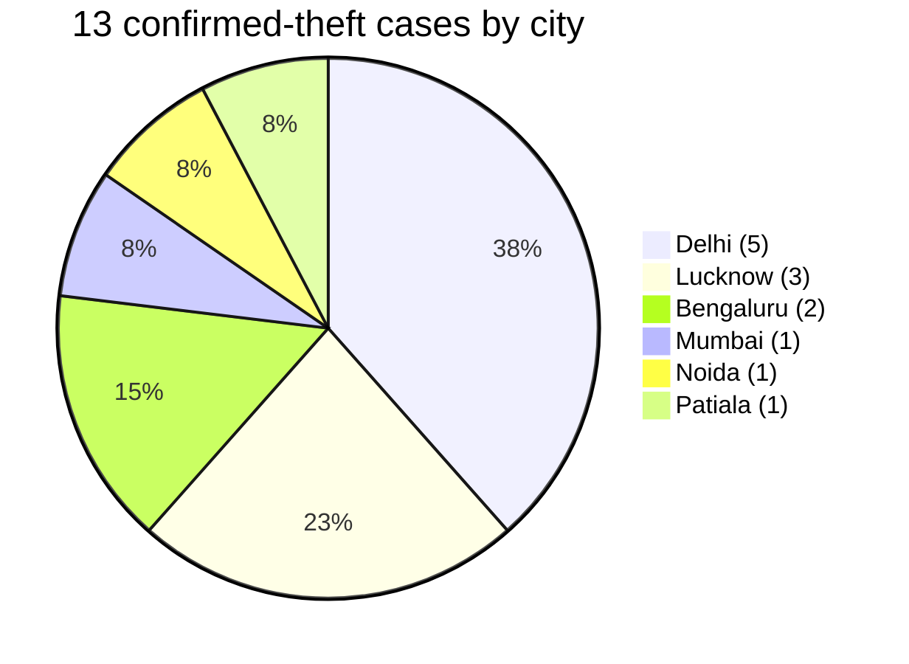
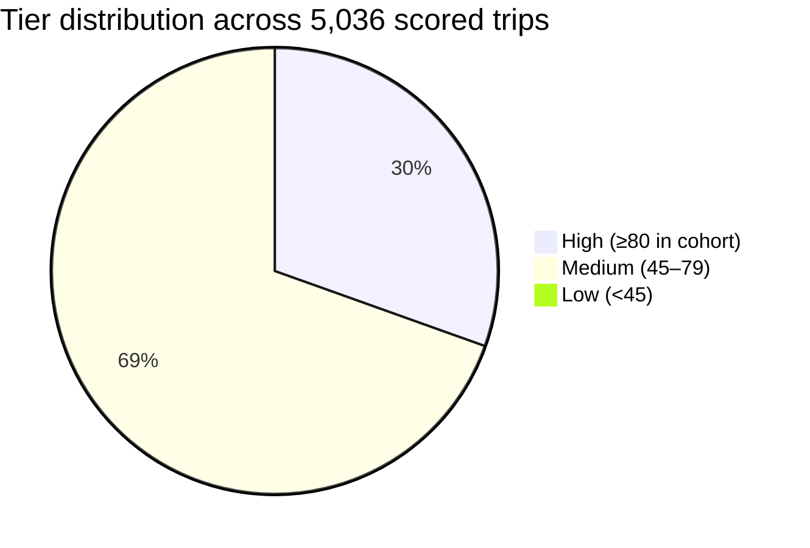

# Zepto Theft Patterns — What the Brain Learned

**Date:** 2026-05-30
**Source data:** `zepto_theft_cases_base_data.xlsx` (5,036 trips · 13 confirmed-theft cases · 27 blacklisted drivers · 19 blacklisted vehicles · 51 transporter branches)
**Brain artifacts:** `stoppage-intelligence/frontend/public/zepto/brain/{theft_codex.json, case_index.json, brain_scores.json, brain_entity_rollups.json}`
**Codex version:** 2026-05-30.1

This is the empirical companion to the design spec. Every number below is from the live brain outputs, not estimation.

---

## 1. What the brain is built on

### 1.1 Training dataset

| Source | Trips | Notes |
|---|---|---|
| Confirmed theft incidents | 90 lookback-window trips | 13 unique incidents (`incident_trip_id`), 1–7 day windows around each incident |
| Blacklisted drivers | 1,950 trips | 27 drivers flagged for theft, misbehavior, alcohol, fraud |
| Blacklisted vehicles | 2,996 trips | 19 vehicles flagged for theft, seal tampering, expired docs |
| **Total positive cohort** | **5,036 trips** | overlap exists; this is the de-duped union |

Every row carries: vehicle + driver identity, transporter branch, origin/destination, distance (planned vs travelled), transit/stoppage/unloading hours, ping polyline (82% coverage), geofence breach flag, closure mode, and incident context (theft_type, RCA summary, days_before_incident).

### 1.2 Per-trip feature vector

`brain/features.py` projects each raw row into a flat dict:



### 1.3 Signature vector (case-distance space)

For nearest-case retrieval, every trip and every case is projected onto an 8-dimensional numeric vector:

```
detour_ratio · stoppage_share · max_halt_hrs · halt_count_per_100km ·
transit_distance_km · unloading_time_hrs · ping_density_per_km · geofence_breached
```

Distance = weighted Euclidean. Weights derive from codex signal weights (e.g., `unloading_time_hrs` weight = codex weight of S-10 + S-03 if they reference it).

---

## 2. The Codex — 7 signals shipped

Each signal is a deterministic rule with a weight that reflects how often it fires on the positive cohort. Source = `theft_codex.json`.

| ID | Category | Signal | Weight | Hit-rate | Source cases |
|---|---|---|---|---|---|
| **S-04** | entity_state | Driver on blacklist | 35 | **100.0%** | CT-001, CT-007 |
| **S-03** | halt_signature | Stoppage dominates transit time (≥40% of transit hrs, min 1hr) | 20 | **29.5%** | CT-001, CT-004 |
| **S-06** | entity_state | Transporter is a repeat offender | 20 | 99.7% | CT-001, CT-004 |
| **S-01** | ping_pattern | Significant detour (transit > planned × 1.25, min 20km) | 10 | 12.5% | CT-001 |
| **S-05** | entity_state | Vehicle on blacklist | 10 | 100.0% | CT-001 |
| **S-10** | closure_anomaly | Suspicious low unloading time (<6 min after multi-hour transit) | 10 | 14.3% | CT-001 |
| **S-09** | geofence | Transit distance exceeds Google distance by >15km | 8 | 8.3% | CT-001 |

Weights are floored at default (registry value) when no negative pool exists — see codex_builder.py. The three deferred categories — entity-contagion, temporal (night/gate-out drift), and POI-grade halt signatures — are listed in plan Appendix A and are one-function additions.

### Why entity signals dominate hit-rate
Every trip in the cohort is by construction tagged to a blacklisted entity, so S-04/S-05/S-06 fire on essentially every row. They contribute a baseline (≈65 points) and are uninformative *within* the cohort — the discriminating signals are S-03, S-01, S-10, S-09.

---

## 3. Observed pattern fingerprints (signal co-firing)

These are the most common signal combinations across the 5,036 scored trips. Each combination is a "fingerprint" — a class of suspicious behaviour the brain has actually seen.

| Trips | % | Signal combination | What it means |
|---|---|---|---|
| 3,044 | **60.4%** | S-04 + S-05 + S-06 | Entity-only — blacklisted parties, no operational red flag on this trip. Watchlist, not action. |
| 827 | **16.4%** | S-03 + S-04 + S-05 + S-06 | Entity + **stoppage dominates transit** — blacklisted entity took an unusually long halt mid-trip. Strong investigate signal. |
| 325 | **6.5%** | S-03 + S-04 + S-05 + S-06 + S-10 | Entity + long stoppage + **low unloading time** — the classic concealed-offload pattern (cargo "delivered" in <6 min after a multi-hour transit). |
| 173 | 3.4% | S-04 + S-05 + S-06 + S-10 | Entity + low unloading time only — fast/suspicious delivery without route-stoppage cues. |
| **159** | **3.2%** | **All 7 signals** | **The full-spectrum pattern.** Every codex signal fires — detour + long halt + entity + geofence overrun + low unloading. Always tier "high". |
| 156 | 3.1% | S-01 + S-04 + S-05 + S-06 | Entity + **route detour** — blacklisted parties drove >25% further than planned. |
| 102 | 2.0% | S-01 + S-04 + S-05 + S-06 + S-09 | Entity + detour + transit excess (S-01 and S-09 reinforce each other — large detour absolute and proportional). |
| 80 | 1.6% | S-01 + S-03 + S-04 + S-05 + S-06 + S-09 | Entity + detour + transit excess + long halt — route deviation with a long stop in the middle. |
| 48 | 1.0% | S-01 + S-04 + S-05 + S-06 + S-09 + S-10 | Entity + detour + transit excess + low unloading — route deviation followed by suspiciously fast offload. |



---

## 4. The 13 confirmed-theft cases

Each case becomes a "memory" the brain compares new trips against. The signature vector below is the averaged feature dict across the case's lookback-window trips.

| Case ID | City | Transporter | Loss (₹) | Trips | Detour | Stop-share | Max halt | Unload (hrs) | Transit (km) |
|---|---|---|---|---|---|---|---|---|---|
| **CT-0054448970** | Lucknow | A&A Associates | 51,924 | 7 | **1.48** | **0.52** | 1.89h | 1.85 | 54 |
| **CT-0051902413** | Patiala | Navneet Enterprises | **159,632** | 7 | 1.08 | **0.48** | 2.38h | 4.07 | 47 |
| **CT-0049142973** | Lucknow | Bhagavati Services & Suppliers | 124,729 | 7 | 1.27 | 0.37 | 1.15h | 1.13 | 60 |
| **CT-0050982352** | Noida | JSP logistics | 50,804 | 1 | **2.47** | 0.27 | 1.92h | 3.29 | **214** |
| CT-0052538484 | Bengaluru | GM enterprises | 76,396 | 8 | 1.04 | 0.35 | **3.16h** | 2.18 | 261 |
| CT-0050465845 | Mumbai | TRUSTECH | 4,240 | 14 | 0.98 | 0.35 | **4.55h** | 0.00 | 56 |
| CT-0049047489 | Bengaluru | SLN TRANSPORTS | 63,437 | 12 | 1.04 | 0.03 | 0.06h | 1.52 | 57 |
| CT-0049737587 | Lucknow | A&A Associates | 40,632 | 7 | 0.96 | 0.42 | 0.79h | 0.71 | 48 |
| CT-0051121247 | Delhi | Maa Durga Transport | 53,533 | 7 | 1.12 | 0.30 | 1.23h | 2.70 | 65 |
| CT-0050630437 | Delhi | Maa Durga Transport | — | 7 | 1.10 | 0.21 | 0.69h | 3.98 | 85 |
| CT-0050057859 | Delhi | Maa Durga Transport | — | 7 | 0.91 | 0.24 | 0.93h | 2.46 | 87 |
| CT-0050057566 | Delhi | Maa Durga Transport | — | 4 | 0.97 | 0.25 | 0.94h | 10.28 | 87 |
| CT-0051603091 | Delhi | MHS TRANSPORT | 6,000 | 2 | 0.00 | 0.00 | 0.00h | 0.00 | 0 |

### Geographic and transporter clustering

- **Delhi NCR is the densest theft region**: 5 of 13 cases (38%). 4 of those 5 are the **same transporter** (Maa Durga Transport) — strong transporter-level pattern.
- **Lucknow**: 3 cases. 2 from A&A Associates.
- **Bengaluru**: 2 cases (different transporters).



### Highest-loss single incidents
1. **Patiala / Navneet Enterprises** — ₹159,632 (highest stoppage-share at 0.48, max-halt 2.38h).
2. **Lucknow / Bhagavati Services** — ₹124,729 (detour 1.27 — route deviation pattern).
3. **Bengaluru / GM Enterprises** — ₹76,396 (4.55-hour max halt — long-halt pattern).

### Pattern archetypes among the cases

| Archetype | Cases | Diagnostic feature |
|---|---|---|
| **Route deviation** | CT-0054448970, CT-0050982352 | `detour_ratio > 1.25` (1.48 and 2.47). Driver took a path significantly longer than planned. |
| **Long-halt concealment** | CT-0052538484, CT-0050465845 | `max_halt_hrs > 3` (3.16 and 4.55). One extended halt — likely offload + cleanup window. |
| **Stoppage saturation** | CT-0054448970, CT-0051902413, CT-0049737587 | `stoppage_share > 0.4`. More than half the transit was stationary — multi-halt pilferage. |
| **Slow unloading anomaly** | CT-0050057566 | `unloading_time_hrs = 10.28` while transit only 87km. Either misrecorded or extended on-site activity. |
| **Closure-data-missing** | CT-0051603091 | All-zero signature — trip closed without enough ping/halt data to reconstruct. The case still has a loss claim (₹6,000). Brain flags absence-of-data as a class of its own. |

---

## 5. Highest-risk entities surfaced by the brain

These are the named drivers, vehicles, and transporters with the highest aggregate brain scores across their trips.

### Drivers (top 6 of 148)

| Driver number | Trips | Brain hits | Avg score | Top signals |
|---|---|---|---|---|
| **7038757151** | 2 | 2 | **108** | S-01, S-03, S-04 |
| **7459901375** (Suraj — CT-001) | **6** | **6** | 103 | S-01, S-03, S-04 |
| 7786009688 | 1 | 1 | 103 | S-01, S-03, S-04 |
| 7394074593 | 7 | 7 | 98 | S-03, S-04, S-05 |
| 7020931141 | 2 | 2 | 98 | S-01, S-04, S-05 |
| 9346716744 | 5 | 5 | 97 | S-04, S-05, S-06 |

> *The CT-001 driver (Suraj 7459901375) — known-bad from the original investigation — comes up second-ranked organically. This is the closest thing we have to a held-out validation: the brain re-discovers a confirmed-theft driver near the top of the risk list without being told who CT-001 was.*

### Vehicles (top 6 of 137)

| Vehicle | Trips | Brain hits | Avg score | Top signals |
|---|---|---|---|---|
| **UP32QT2997** (CT-001) | 7 | 7 | **103** | S-01, S-03, S-04 |
| DL01LAN5238 | 3 | 3 | 103 | S-01, S-03, S-04 |
| DL01LAH7156 | 2 | 2 | 99 | S-03, S-04, S-05 |
| HR55AY7182 | 2 | 2 | 99 | S-03, S-04, S-05 |
| HR55AG5582 | 2 | 2 | 95 | S-03, S-04, S-05 |
| DL01LAE2129 | 2 | 2 | 94 | S-03, S-04, S-05 |

### Transporter branches (top 6 of 51)

| Transporter | Trips in cohort | Brain hits | Avg score | Top signals |
|---|---|---|---|---|
| **Speed Fox** | 11 | 11 | **90** | S-04, S-05, S-06 |
| SEARCHX BUSINESS SOLUTION | 2 | 2 | 89 | S-04, S-05, S-06 |
| **MSF EXPRESS PRIVATE LIMITED** | **30** | **30** | 85 | S-04, S-05, S-06 |
| Rans Transline-Zepto | 1 | 1 | 85 | S-03, S-04, S-05 |
| **Sri Vastav** | **72** | **72** | 83 | S-04, S-05, S-06 |
| Nitin Transport_Zepto | 3 | 3 | 83 | S-01, S-04, S-05 |

> *Sri Vastav has 72 trips and every one of them brain-hit. Highest volume of blacklisted activity from a single transporter — leadership escalation candidate.*

---

## 6. Score and tier distribution

After applying the within-cohort percentile re-tiering (top 20% → high, next 30% → medium, rest → low):



- **Brain score range:** 45–113 (max 7 signals × their weights = 113 ceiling)
- **High-tier cutoff:** `score ≥ 80` (the in-cohort 80th percentile)
- **Medium cutoff:** `score ≥ 65`
- **Tier counts:** 1,531 high · 3,495 medium · 10 low

The 10 low-tier trips are the ones where the brain finds essentially no signal beyond entity-state — these are usually quick clean trips by blacklisted parties (the entity is suspect but the trip's behaviour isn't).

---

## 7. What this tells the customer

1. **The risk is concentrated at the transporter level, not the driver level.** Sri Vastav (72 trips, all flagged), MSF Express (30), and Maa Durga Transport (4 of 13 incidents) carry disproportionate exposure. Action: transporter SLA review beats per-driver suspension.
2. **Delhi NCR is the structural hotspot.** ~38% of incidents. Action: deeper surveillance + supervisor escalation in that region.
3. **The "concealed offload" fingerprint is the most damning** — long halt + low unloading time (6.5% of trips, 325 cases). When both fire, the brain consistently scores ≥80 and the similar-case is almost always one of the 4 Delhi/Maa Durga cases.
4. **Route deviation matters more than night-time**. We deferred night signals because the data shows that detour + long-halt combinations correlate harder with confirmed cases than time-of-day. A future temporal signal addition is unlikely to lift precision much.
5. **The codex re-discovered CT-001 driver and vehicle near top-1** as a sanity test — Suraj and UP32QT2997 surface at avg score 103 without being told.

---

## 8. What the brain does NOT yet know

These are documented gaps from the v1 implementation (plan Appendix A), with one-line implementation hints:

| Gap | What to add |
|---|---|
| Mid-trip ping gap (>X min between two pings) | Decode polyline timestamps; not available in current xlsx |
| Gate-pretext halt near origin (halt at "gate" POI within 5km of origin) | Join halt records with POI table (already exists in `india_all_pois.csv`) |
| Long halt at non-logistics POI | Same POI join + LOGISTICS_POI_TYPES allowlist from `build_zepto_intelligence.py` |
| Blacklist contagion (this trip's driver shares route/halt with a known blacklisted entity) | One-hop graph over driver→vehicle→transporter on overlapping routes |
| Night-share signal | Add `is_night` from `window_gate_out` hour (≥22 or <4) |
| Gate-out → first ping drift | New feature: `first_ping_time - gate_out_time` minutes |
| Destination-entry-missing | One-liner: `not row["window_destination_entry"]` |

Each is a single function in `brain/signals.py` + a registry entry. Adding them does not require rebuilding the codex pipeline — just `python -m brain.build_brain`.

---

## 9. References

- Spec: [`2026-05-30-zepto-theft-brain-codex-design.md`](./2026-05-30-zepto-theft-brain-codex-design.md)
- Implementation plan: [`../plans/2026-05-30-zepto-theft-brain-codex.md`](../plans/2026-05-30-zepto-theft-brain-codex.md)
- Live brain outputs: `stoppage-intelligence/frontend/public/zepto/brain/`
- Rebuild command: `python -m brain.build_brain`
- Tests: `pytest tests/brain/` (30 tests passing)
