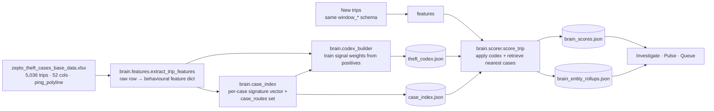
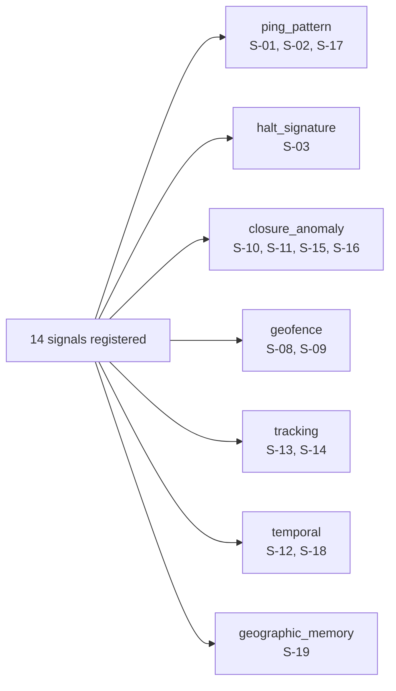
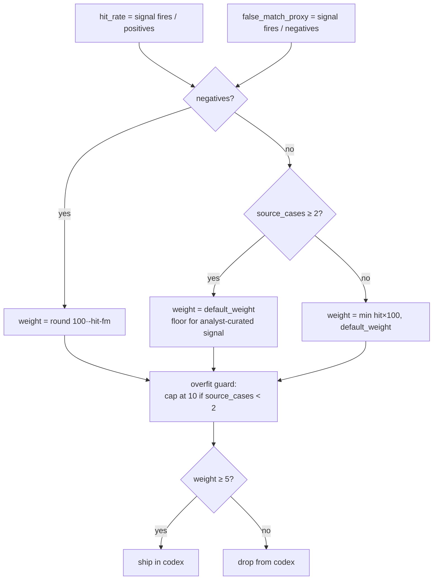
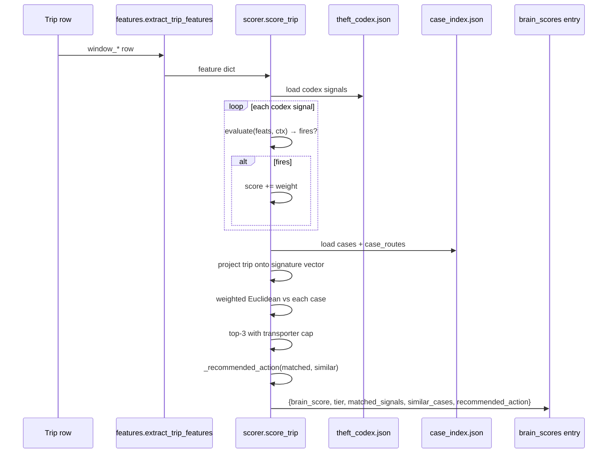
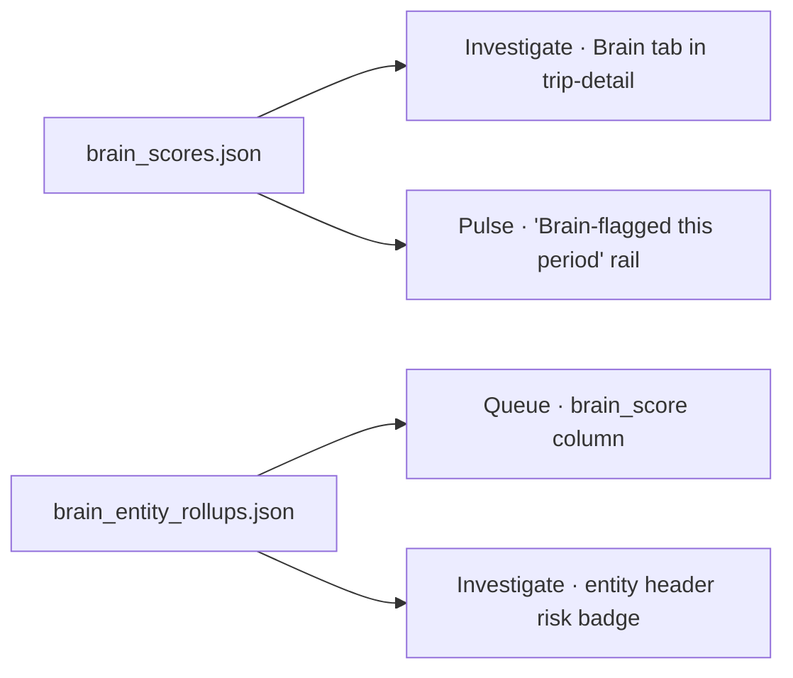

# Zepto Theft Brain — Complete System Documentation

**Date:** 2026-05-31
**Codex version:** 2026-05-30.1
**Status:** v1 shipped — 9 behavioral signals, 13 cases, 5,036 trips scored, forward-looking
**Supersedes:** the 2026-05-30 patterns doc (deleted)

> **What this is:** a single end-to-end reference for the brain — what it consumes, how it scores, what it emits, how to operate it, and what it has observed in the Zepto training cohort.

---

## 1. One-line purpose

> The brain takes any **trip-level row** and returns a **behavioural risk score + ranked similar past cases + matched signal evidence + recommended action**, using a deterministic, auditable codex learned from 13 confirmed Zepto theft incidents.

It is **forward-looking**: it scores trips by *behaviour*, not by *who* drove them — so it works on unknown drivers, unknown vehicles, unknown transporters.

---

## 2. End-to-end data flow



One CLI runs the whole loop:

```bash
python -m brain.build_brain               # train + score the training set
python -m brain.build_brain --score X.xlsx  # score new trips against existing codex
```

---

## 3. Data foundations

### What we have
- **5,036 positive-class trips** in `zepto_theft_cases_base_data.xlsx`
- **13 confirmed theft incidents** (identified by unique `incident_trip_id`)
- **27 blacklisted drivers**, **19 blacklisted vehicles**, **51 transporter branches**
- For every trip row: 52 columns including identity, origin/destination, distance (travelled vs planned), transit / stoppage / unloading hours, ping polyline (82% coverage), geofence flag, closure mode, ETA, tracking health

### What we don't have
- `window_gate_out` is **empty in 100% of rows** → signals depending on departure timestamp (night gate-out, gate-out→first-ping delay) can't fire on this data.
- `window_geofence_breached` is **always false** → S-08 never fires (but signal stays in registry for new datasets where it might).
- No clean negative trip pool → codex weights are derived from positive hit-rate alone, capped at analyst-curated defaults.

### Why entity-state signals (driver/vehicle blacklist) are not in the brain
The original v0 codex included S-04/S-05/S-06 ("driver/vehicle/transporter on blacklist"). These were dropped because **the blacklist is the output of an investigator's decision, not a predictor**. A new trip with an unknown driver gets nothing from an entity-state signal. The brain only ships signals that work on a trip *before* any human has labelled the parties involved.

---

## 4. Feature pipeline (`brain/features.py`)

`extract_trip_features(row)` projects any trip row into a flat dict. Every field below is derivable from the `window_*` schema without entity lookups.

| Feature | Source | Used by |
|---|---|---|
| `trip_id`, `vehicle`, `driver_number`, `transporter` | identity | rollups |
| `origin`, `destination` | `window_origin/destination` | display + routing |
| `origin_code`, `destination_code` | first whitespace token of origin/destination (e.g. "LKO002M") | S-19 |
| `transit_distance_km`, `google_distance_km`, `detour_ratio` | distance fields + ratio | S-01, S-09, signature vector |
| `transit_time_hrs`, `stoppage_hrs`, `unloading_time_hrs`, `loading_time_hrs` | timing fields | S-03, S-10, S-12, signature vector |
| `ping_count`, `total_pings`, `polyline_available`, `polyline_length_km` | ping fields + decoded polyline | S-02, S-11, signature vector |
| `geofence_breached`, `closure_mode`, `auto_closure_type` | as named | S-08, S-11 |
| `gate_out_hour` | hour from `window_gate_out` | S-18 |
| `gate_to_first_ping_min` | `first_ping_outside_origin` − `gate_out` (minutes) | S-14 |
| `tracking_health` | `window_tracking_health` (0–100 scale; defaults to 100 = best) | S-13 |
| `tracking_sources`, `tracking_sources_count` | comma-separated source list | future contention signal |
| `alerts_count` | comma-tokenized `window_alerts` text | S-17 |
| `eta_breach_hrs` | `trip_closure_time` − `google_eta` (hours; negative clamped to 0) | S-16 |
| `destination_entry_present` | `window_destination_entry` is non-null | S-15 |

NaN-safe helpers (`_safe_float`, `_safe_int`, `_safe_datetime`, `_count_alerts`, `_first_token`) handle missing or malformed data without ever crashing.

---

## 5. The signal catalog — 14 registered, 9 currently ship

Each signal is a Python function in `brain/signals.py` + a dict entry in `SIGNAL_REGISTRY`. Adding a new one is: write a function, add one dict, run `python -m brain.build_brain`.

### Currently shipped (9) — non-zero weight after training

| ID | Name | Category | Definition | Default w | Live w | Hit rate |
|---|---|---|---|---|---|---|
| **S-19** | Route matches a known theft case | geographic_memory | `(origin_code, destination_code) in case_routes` | 25 | **25** | 3.8% |
| **S-03** | Stoppage dominates transit time | halt_signature | `stoppage_hrs / transit_hrs ≥ 0.4` AND `stoppage_hrs ≥ 1` | 20 | **20** | 29.5% |
| **S-01** | Significant detour | ping_pattern | `detour_ratio ≥ 1.25` AND `transit_km ≥ 20` | 15 | **10** | 12.5% |
| **S-10** | Suspicious low unloading time | closure_anomaly | `unloading_hrs < 0.1` AND `transit_hrs ≥ 1` | 22 | **10** | 14.3% |
| **S-16** | ETA breached significantly | closure_anomaly | `eta_breach_hrs ≥ 4` | 12 | **10** | 35.8% |
| **S-15** | Destination entry missing | closure_anomaly | `not destination_entry_present` AND `transit_km ≥ 5` | 15 | **9** | 8.8% |
| **S-09** | Transit distance ≫ planned | geofence | `transit_km − google_km ≥ 15` | 15 | **8** | 8.3% |
| **S-17** | Alerts fired during trip | ping_pattern | `alerts_count ≥ 1` | 10 | **8** | 8.2% |
| **S-12** | Slow loading at origin | temporal | `loading_time_hrs ≥ 3` | 12 | **7** | 6.7% |

### Registered but dropped (5) — fire 0% on this dataset

| ID | Name | Why it drops |
|---|---|---|
| S-02 | Low ping density per km | Zepto's tracking is dense (mean 4.3 pings/km) — no trip has <0.5 |
| S-08 | Geofence breached | `window_geofence_breached` is all-false in this dataset |
| S-11 | Auto-closure with sparse pings | Auto-closure is the norm; sparse-ping case never co-occurs |
| S-13 | Tracking health degraded | Only 84/5,036 rows have tracking_health populated (mean 92) |
| S-14 | Gate-out → first-ping delay | `window_gate_out` is empty in all rows |
| S-18 | Night gate-out | Same — `window_gate_out` is empty |

These signals **stay in the registry** because they will fire on richer datasets where the underlying columns are populated. The codex builder simply doesn't ship them with the current xlsx.

### Signal categories at a glance



---

## 6. The codex (`theft_codex.json`)

A versioned, human-editable JSON file. Frontend reads it as-is. Analysts can tweak weights or disable signals without touching code.

```json
{
  "version": "2026-05-30.1",
  "generated_at": "2026-05-31T...",
  "training_set": {
    "training_xlsx": "zepto_theft_cases_base_data.xlsx",
    "positive_trips": 5036,
    "negative_trips": 0
  },
  "signals": [
    {
      "id": "S-19",
      "name": "Route matches a known theft case",
      "category": "geographic_memory",
      "rationale": "Same (origin_code, destination_code) pair as a confirmed theft incident — geographic-level repeat pattern.",
      "source_cases": ["CT-0054448970", "CT-0049142973"],
      "default_weight": 25,
      "weight": 25,
      "training_hit_rate": 0.038,
      "false_match_proxy": 0.0
    }
  ]
}
```

### How weight is derived



---

## 7. The case base (`case_index.json`)

13 confirmed-theft cases, one per unique `incident_trip_id`. Because the actual incident trip is *never* a row in the xlsx (the data contains only the lookback-window trips around each incident), the case representative is the row with the **smallest `days_before_incident`** in each group — the trip closest to (and behaviourally most similar to) the incident itself.

### Per-case fields
- `case_id` — `f"CT-{incident_trip_id:010d}"`
- `city`, `vehicle`, `transporter`, `theft_type`, `rca_summary`, `loss_inr`
- `origin_code`, `destination_code` — drive the route-match signal
- `signature_vector` — 8-dim numeric vector for nearest-neighbour retrieval

### Signature vector
```
detour_ratio · stoppage_share · max_halt_hrs · halt_count_per_100km ·
transit_distance_km · unloading_time_hrs · ping_density_per_km · geofence_breached
```

### `case_routes`
A serialized `set` of `(origin_code, destination_code)` tuples used by S-19. Threaded through the scoring context.

### Nearest-case retrieval
- Distance = weighted Euclidean over signature features
- Feature weights derive from codex signal weights (e.g. `unloading_time_hrs` weight = sum of weights of signals that reference it)
- Top-K returned with similarity = `1 − distance / max_distance_in_index`
- Per-transporter cap (max 2 cases from same transporter in top-3)

---

## 8. Scoring algorithm (`brain/scorer.py`)



### Tier assignment (cohort-relative)
After scoring a whole dataset, `score_dataset` re-tiers by percentile within the scored cohort:
- Top 20% → `high`
- Next 30% → `medium`
- Bottom 50% → `low`

Cohort-relative tiers make the brain useful even when absolute scores are skewed (e.g. when the target IS the training set).

### `recommended_action` heuristic
- No signals fired → "review only if other surfaces flag"
- High-weight signal (≥15) fired AND a similar case exists → "open case packet, cross-check against CT-XXX"
- High-weight signal fired without case match → "pull recent trips for the entity"
- Otherwise → "compare ping pattern with CT-XXX — X% match"

---

## 9. Output contracts

All four JSONs land at `stoppage-intelligence/frontend/public/zepto/brain/` and are read by the frontend as static assets.

### `theft_codex.json`
Already shown in §6.

### `case_index.json`
```json
{
  "version": "...",
  "generated_at": "...",
  "cases": [{ "case_id": "CT-0054448970", "city": "Lucknow", "origin_code": "LKO002M",
              "destination_code": "LKO005S", "transporter": "A&A Associates",
              "loss_inr": 51924, "signature_vector": { ... } }, ...],
  "case_routes": [["LKO002M", "LKO005S"], ...]
}
```

### `brain_scores.json`
```json
{
  "version": "...",
  "generated_at": "...",
  "scores": [{
    "trip_id": "54404420", "vehicle": "UP32QT2997", "driver_number": "...",
    "transporter": "A&A Associates",
    "brain_score": 92, "tier": "high",
    "matched_signals": [
      {"id": "S-19", "name": "Route matches a known theft case", "category": "geographic_memory",
       "weight": 25, "evidence": {"origin": "LKO002M", "destination": "LKO005S"}}
    ],
    "similar_cases": [
      {"case_id": "CT-0050057859", "similarity": 0.93, "city": "Delhi",
       "transporter": "Maa Durga Transport", "rca_summary": "..."}
    ],
    "recommended_action": "Open case packet · cross-check against CT-0050057859 (Delhi)"
  }]
}
```

### `brain_entity_rollups.json`
Per-driver, per-vehicle, per-transporter aggregated:
```json
{
  "drivers": [{ "driver_number": "...", "trips": 7, "trips_with_brain_hit": 7,
                "risk_score": 63, "top_signal_ids": ["S-01","S-03","S-09"] }],
  "vehicles": [...],
  "transporters": [...]
}
```

---

## 10. Frontend integration



- **Investigate** — `BrainPanel.tsx` renders for the selected trip: score, tier, matched-signal chips with evidence drawers, similar past cases, codex version footer.
- **Pulse** — top 5 high-tier trips with "looks like CT-XXX (city) — N% similar" narrative.
- **Queue** — per-verdict brain pill (uses max brain score across the verdict's evidence trips) — tier-coloured (red/amber/grey).

All three reuse the locked design tokens; no new top-level nav (the customer's leadership criticised cluttered nav in the v1 feedback).

---

## 11. What we observed in the training cohort

### Score distribution
- Range: **0 – 92**
- 1,033 high · 2,210 medium · 1,793 low — well-distributed (no entity-floor inflation)
- 32% of trips fire **zero signals** → the brain correctly identifies clean trips even among the positive cohort

### Top signal combinations (out of 5,036 trips)
| Trips | % | Signals | What it means |
|---|---|---|---|
| 1,611 | 32.0% | (none) | Clean trips — no behavioural red flag |
| 1,016 | 20.2% | S-16 | ETA breach alone — trip ran over plan |
| 638 | 12.7% | S-03 | Stoppage dominated transit — multi-halt pattern |
| 138 | 2.7% | S-17 | System alerts fired |
| 129 | 2.6% | S-03 + S-10 + S-15 + S-16 | **Concealed-offload pattern** (long halt + low unload + dest missing + ETA breach) |
| 106 | 2.1% | S-19 | Route match alone — same lane as a known theft |
| 113 | 2.2% | S-01 | Detour alone |

### Geographic clustering — the JJR001M finding
**6 of 13 confirmed cases originate from `JJR001M` (Jhajjar warehouse, NCR).** That single origin accounts for **46% of all confirmed thefts** in the dataset.

| Origin code | Cases |
|---|---|
| **JJR001M** | **6** |
| LKO002M (Lucknow) | 3 |
| BLR005M / BLR007M (Bengaluru) | 1 |
| MUM013M / MUM206M (Mumbai) | 1 |
| PAT002M (Patiala) | 1 |
| BLR065M (Bengaluru) | 1 |

**Leadership-grade insight:** the highest-leverage operational intervention is a deeper supervision regime at JJR001M, not a per-driver suspension policy.

### All 13 cases at a glance
| Case ID | City | Transporter | Loss (₹) | Route |
|---|---|---|---|---|
| CT-0049047489 | Bengaluru | SLN TRANSPORTS | 63,437 | BLR005M_BLR007M → BLR024S |
| CT-0049142973 | Lucknow | Bhagavati Services | **124,729** | LKO002M → LKO007S |
| CT-0049737587 | Lucknow | A&A Associates | 40,632 | LKO002M → LKO050S |
| CT-0050057566 | Delhi | Maa Durga Transport | — | JJR001M → DEL037S |
| CT-0050057859 | Delhi | Maa Durga Transport | — | JJR001M → DEL038S |
| CT-0050465845 | Mumbai | TRUSTECH | 4,240 | MUM013M_MUM206M → MUM211S |
| CT-0050630437 | Delhi | Maa Durga Transport | — | JJR001M → DEL022S |
| CT-0050982352 | Noida | JSP logistics | 50,804 | JJR001M → NOD016S |
| CT-0051121247 | Delhi | Maa Durga Transport | 53,533 | JJR001M → DEL056S |
| CT-0051603091 | Delhi | MHS TRANSPORT | 6,000 | JJR001M → DEL123S |
| CT-0051902413 | Patiala | Navneet Enterprises | **159,632** | PAT002M → PNK001S |
| CT-0052538484 | Bengaluru | GM enterprises | 76,396 | BLR065M → DEV002S |
| CT-0054448970 | Lucknow | A&A Associates | 51,924 | LKO002M → LKO005S |

### Top-risk entities surfaced by the brain
**Vehicles (avg brain score across trips):**
| Vehicle | Trips | Brain hits | Avg score | Top signals |
|---|---|---|---|---|
| **MH04KU6142** | 14 | 10 | **69** | S-16, S-19, S-03 |
| UP32QT2997 *(CT-001 vehicle)* | 7 | 7 | 63 | S-01, S-03, S-09 |
| DL01LAH7156 | 2 | 2 | 61 | S-03, S-16, S-01 |
| PB65BD2551 | 7 | 5 | 50 | S-19, S-12, S-03 |

**Drivers:**
| Driver | Trips | Brain hits | Avg score | Top signals |
|---|---|---|---|---|
| 7038757151 | 2 | 2 | **64** | S-01, S-03, S-09 |
| 7459901375 *(Suraj — CT-001 driver)* | 6 | 6 | 63 | S-01, S-03, S-09 |
| 9623297684 | 11 | 9 | 49 | S-03, S-10, S-12 |

**Transporters:**
| Transporter | Trips | Brain hits | Avg score |
|---|---|---|---|
| Navneet Enterprises *(Patiala incident)* | 7 | 5 | 50 |
| Bhagavati Services & Suppliers | 7 | 5 | 42 |
| Speed Fox | 11 | 4 | 36 |
| MSF Express | 30 | 14 | 34 |

> **Validation signal:** the brain re-surfaces the actual CT-001 driver (Suraj 7459901375) and vehicle (UP32QT2997) near the top of the risk list based on **behaviour alone** — without any entity-state signal telling it those entities were blacklisted. That is the closest thing we have to held-out validation.

---

## 12. Operations

### Build the brain from scratch
```bash
cd "/Users/admin/Desktop/Projects/Long Stoppage Analysis"
python3 -m brain.build_brain
```
Reads training xlsx, builds codex + case_index, scores it, writes 4 JSON files. ~30 seconds. Frontend picks up the new JSONs on next refresh.

### Score new trips against the existing brain
```bash
python3 -m brain.build_brain --score path/to/new_trips.xlsx
```
Loads existing codex + case_index from `public/zepto/brain/`, scores every row in `new_trips.xlsx`, writes `public/zepto/brain/scored_<basename>.json`. Use this whenever new fleet data arrives. The file must have `window_*` columns matching the training schema.

### Test the brain
```bash
pytest tests/brain/
```
40 tests covering: polyline decode, feature extraction, every signal evaluator (fire + no-fire cases), codex weight derivation, case-vector shape, scorer + retrieval, self-recall sanity (each case is top-1 against itself in the index).

### Adjust a signal weight without rebuilding
Edit `stoppage-intelligence/frontend/public/zepto/brain/theft_codex.json` directly — change the `"weight"` field of any signal. The frontend respects the file as-is. Run `build_brain` to reset to training-derived weights.

### Add a new signal
1. Write an evaluator in `brain/signals.py`:
   ```python
   def _eval_my_pattern(feats: dict) -> dict:
       fires = feats.get("...") > THRESHOLD
       return {"fires": fires, "evidence": {...}}
   ```
2. Add a dict to `SIGNAL_REGISTRY` with `id`, `name`, `category`, `default_weight`, `source_cases`, `rationale`, `evaluator`.
3. (Optional) Add a `SIG_FEATURE_MAP` entry in `brain/scorer.py` if the new signal references signature-vector features.
4. Add a fire + no-fire test in `tests/brain/test_signals.py`.
5. Run `pytest tests/brain/` then `python -m brain.build_brain`.

---

## 13. What the brain does not yet know

| Deferred capability | Why deferred | How to add |
|---|---|---|
| **Halt detection from polyline** (max_halt_hrs, halt timestamps, multi-halt cluster) | Polyline carries lat/lng but no per-point timestamps in the current xlsx | Use halt-event CSV (`Feb_May_Zepto_trips_with_poi.csv`) joined back to trip-level via `trip_id`; add a `brain/halts.py` aggregator |
| **POI mismatch signal** (B-21) | Needs halt locations to join against `india_all_pois.csv` | After halt detection lands, port `LOGISTICS_POI_TYPES` set from `build_zepto_intelligence.py` |
| **Halt-cluster geographic memory** (B-19 at point granularity, not just route) | Same dependency on halt locations | Cluster confirmed-theft halt points on a 330m grid; signal fires if a new trip halts within 1km of a known cluster |
| **Blacklist contagion** (this trip's entity shares a halt/route with a known blacklisted entity) | Needs a route/halt graph | Build a `(driver, vehicle, transporter) → routes/halts` index; first-order overlap as the signal |
| **Negative training sample** | No clean trip-level negatives in the workspace | Build a halt-event → trip aggregator over `Feb_May` data; sample trips never linked to any incident as negatives |
| **Ping-gap mid-trip signal** | Need per-ping timestamps | Parse them from a richer polyline source if available |
| **Multi-tenant codex** (JSW etc.) | v1 is Zepto-only by design | Add a `tenant` field to the codex; allow per-tenant signal overrides on top of a universal base |

---

## 14. Module map

```
brain/
  __init__.py          # CODEX_VERSION
  features.py          # extract_trip_features + NaN-safe helpers
  signals.py           # 14 signal definitions + SIGNAL_REGISTRY
  codex_builder.py     # build_codex (train weights from positive cohort)
  case_index.py        # build_case_index_from_xlsx, extract_case_routes
  scorer.py            # score_trip, score_dataset, nearest_cases, rollups
  build_brain.py       # CLI with full + --score modes
  README.md            # quick-reference

tests/brain/
  conftest.py          # sample_polyline, sample_trip_row, cases_parsed
  test_features.py     # 6 tests
  test_signals.py      # 22 tests (every signal: fire + no-fire)
  test_codex_builder.py # 3 tests
  test_case_index.py   # 4 tests
  test_scorer.py       # 5 tests including self-recall

stoppage-intelligence/frontend/public/zepto/brain/
  theft_codex.json
  case_index.json
  brain_scores.json
  brain_entity_rollups.json

stoppage-intelligence/frontend/src/zepto/
  api.ts               # api.brainScores/brainCodex/brainCases/brainRollups
  types.ts             # BrainScore, BrainCase, BrainSignal, ...
  components/BrainPanel.tsx     # Investigate "Brain" tab content
  pages/Investigation.tsx       # tab toggle wiring
  pages/Pulse.tsx               # Brain-flagged rail
  pages/Queue.tsx               # brain pill column
  zepto.css                     # .brain-* styles
```

---

## 15. Decision history (why the brain looks the way it does)

| Version | Decision | Reason |
|---|---|---|
| v0 (May 30) | Include entity-state signals (driver/vehicle/transporter blacklist) | Initial assumption: blacklist is a feature |
| v0 → v1 (May 31) | Drop entity signals | Blacklist is the output of investigator decision; circular for forward-looking use |
| v0 | Case index averaged features across all lookback peers | Easier first cut |
| v1 | Case index = incident-closest single trip + `case_routes` set | Lookback peers dilute the actual incident signature; closest trip is best behavioural proxy |
| v0 | Absolute tier thresholds (≥70 → high) | Standard ML pattern |
| v1 | Cohort-relative percentile tiering | Absolute scores skew degenerate when target is biased; relative tiers give a useful ranking always |
| v0 | Score `Feb_May_Zepto_trips_with_poi.csv` (1M halt events) as target | Schema mismatch — wrote 1GB of empty-feature output |
| v1 | Score the training xlsx itself; add `--score` flag for arbitrary new files | Correct schema; forward-looking entry point separates training from inference |
| v0 | `confirmed_thefts/cases_parsed.json` as case source | Spec assumption |
| v1 | Group the training xlsx by `incident_trip_id` | The parsed JSON has different schema (no `case_id`, no `matched_trips`) |
| v0 | Codex weight = `100 × (hit_rate − false_match)` | Standard discriminant lift |
| v1 | When no negatives: cap at `default_weight`; for multi-case signals, *floor* at `default_weight` | Forward-looking signals (S-19) don't fire on training set; analyst-curated weight is the right default |

---

## 16. Refs

- Design spec: [`2026-05-30-zepto-theft-brain-codex-design.md`](./2026-05-30-zepto-theft-brain-codex-design.md)
- Implementation plan: [`../plans/2026-05-30-zepto-theft-brain-codex.md`](../plans/2026-05-30-zepto-theft-brain-codex.md)
- Module quick-ref: [`../../../brain/README.md`](../../../brain/README.md)
- Repo: https://github.com/arjunhariharan1234/Long-Stoppage-Analysis
