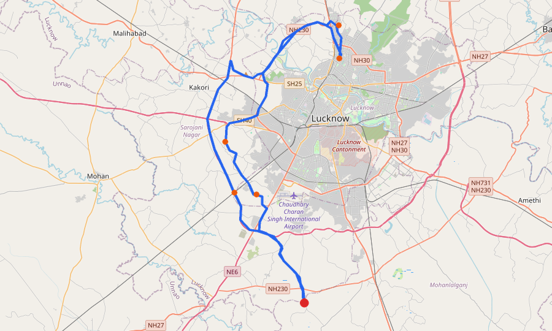
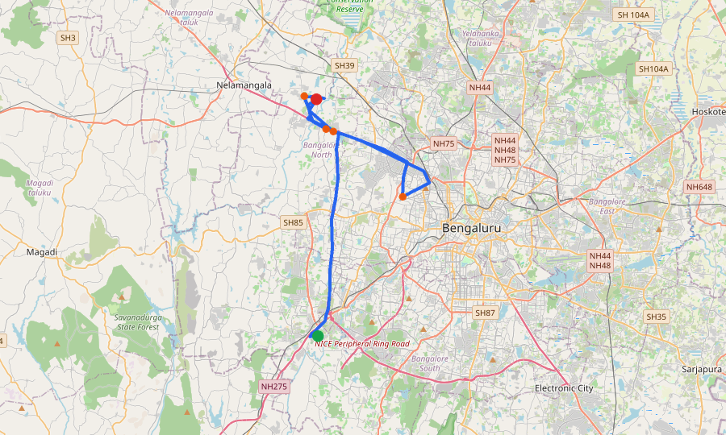
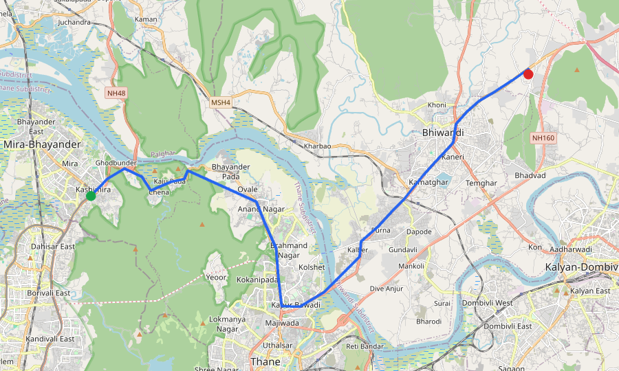
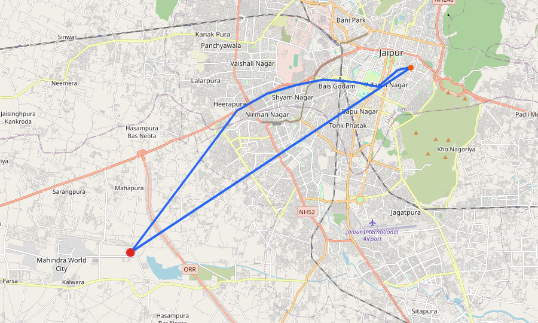

# Suspected Trips — Operations Handoff

**Prepared:** 01 Jun 2026  
**Cases:** Top 5 most-recent high-risk trips we want your operations team to review.

> We have flagged these trips because their behaviour matches patterns we have seen in past confirmed thefts on Zepto's network. Each case below is a single trip; the report explains why we surfaced it, who was driving, and what we recommend you check on the ground.

---

## At-a-glance

| # | Date | Driver | Vehicle | Transporter | Route | Why we flagged it |
|---|---|---|---|---|---|---|
| 1 | 13 Apr 2026 | Akshaya | KA05AQ5752 | JL TRANSPORT | BLR-Nelamangala-DRYMH → BLR-JAYANAGAR New | 4 patterns matched |
| 2 | 06 Apr 2026 | Suraj | UP32QT2997 | A&A Associates | LKO-DRY-MH MOHANLAL GANJ_1 → LKO-Aliganj | 4 patterns matched |
| 3 | 15 Mar 2026 | Akshaya | KA53AC0119 | SLN TRANSPORTS | BLR-Nelamangala-DRYMH → BLR274S-BLR-RR NAGAR New | 7 patterns matched |
| 4 | 09 Mar 2026 | AZAM | MH04LY2701 | Oorja | MUM054S-MUM-Borivali → MUM-DRY-MH-SHAKTI_MUM-SS-MH-SHAKTI | 4 patterns matched |
| 5 | 06 Mar 2026 | dayaram | RJ14GT3961 | NENCY ROAD LINES | JAI030M-KWPL_JAI-FRESH-MH → JAI-Bani Park | 6 patterns matched |

---

## Case 1 · Akshaya on KA05AQ5752

**When:** 13 Apr 2026, 04:53 AM  
**Trip ID:** `54697494`  
**Severity:** **HIGH** (our risk score: 36 / 113)  

_Map unavailable for this trip — GPS path was not recorded._

### Why we want this trip investigated

- **The truck drove much further than the planned route — at least 25% extra distance. That kind of detour usually means an unscheduled stop or a route swap mid-trip.**
- **The trip arrived 4+ hours after the planned ETA — far beyond normal traffic variance. That much delay usually means an unaccounted detour or extended stop.**
- **The truck drove at least 15km more than the planned distance. On a short city run, that's a significant detour off the optimal route.**
- **The platform raised one or more alerts during this trip — halts, route deviations or geofence breaches that operations should have looked at.**

> This trip's behaviour is **96% similar to a confirmed past theft in Patiala** handled by Navneet Enterprises. We recommend you compare what happened on this trip with the operations record for that earlier incident.

### Route and operational stats

| | |
|---|---|
| **Origin** | BLR065M - BLR-Nelamangala-DRYMH |
| **Destination** | BLR092S - BLR-JAYANAGAR New |
| **Distance driven** | 44.3 km (planned: 27.4 km · extra: 16.9 km) |
| **Transit time** | 1.4 hours |
| **Time stopped during transit** | 0.1 hours |
| **Time spent loading at origin** | 1.5 hours |
| **Time spent unloading at destination** | 403 minutes |
| **Late vs planned ETA** | 6.7 hours late |
| **GPS pings recorded** | 305 |
| **Destination arrival recorded?** | Yes (12 Apr 2026, 10:06 PM) |
| **Platform alerts during the trip** | detention_origin,detention_destination,route_deviation,sta_breach |

### Driver profile

**Name:** Akshaya  
**Phone:** 7899467106  
**Total trips we have on record:** 298  
**Trips we have flagged for review:** 6 (of 298)  
**Average risk score across all their trips:** 8  

### Transporter profile

**Branch:** JL TRANSPORT  
**Total trips we have on record:** 128  
**Trips we have flagged for review:** 0 (of 128)  
**Average risk score across all their trips:** 4  

### Vehicle profile

**Vehicle number:** KA05AQ5752  
**Total trips on record for this vehicle:** 2  
**Trips flagged for review:** 0  
**Average risk score:** 18  

### What we recommend you check

- **Pull the actual route taken** and compare with the planned route. Ask the driver to account for the extra distance.
- **Investigate the delay** — the trip arrived hours past the planned ETA. Ask the driver to account for the lost time.
- **Review the in-trip platform alerts** — alerts were raised during this trip but may not have been actioned.

---

## Case 2 · Suraj on UP32QT2997

**When:** 06 Apr 2026, 03:20 PM  
**Trip ID:** `54404420`  
**Severity:** **HIGH** (our risk score: 63 / 113)  

> Green dot = origin · Red dot = destination · Blue line = actual route driven · Orange dots = locations where the truck stopped during the trip.

### Why we want this trip investigated

- **This origin → destination route has been hit before. A past confirmed theft happened on the exact same lane.**
- **The truck spent more time stopped than moving — over 40% of the trip was stationary. That much halt time on a delivery run is unusual.**
- **The truck drove much further than the planned route — at least 25% extra distance. That kind of detour usually means an unscheduled stop or a route swap mid-trip.**
- **The truck drove at least 15km more than the planned distance. On a short city run, that's a significant detour off the optimal route.**

> This trip's behaviour is **100% similar to a confirmed past theft in Lucknow** handled by A&A Associates. We recommend you compare what happened on this trip with the operations record for that earlier incident.

### Route and operational stats

| | |
|---|---|
| **Origin** | LKO002M - LKO-DRY-MH MOHANLAL GANJ_1 |
| **Destination** | LKO005S - LKO-Aliganj |
| **Distance driven** | 52.9 km (planned: 36.6 km · extra: 16.3 km) |
| **Transit time** | 2.9 hours |
| **Time stopped during transit** | 1.3 hours |
| **Time spent loading at origin** | 1.2 hours |
| **Time spent unloading at destination** | 181 minutes |
| **Late vs planned ETA** | 3.3 hours late |
| **GPS pings recorded** | 230 |
| **Destination arrival recorded?** | Yes (06 Apr 2026, 12:14 PM) |

### Driver profile

**Name:** Suraj  
**Phone:** 7459901375  
**Total trips we have on record:** 6  
**Trips we have flagged for review:** 6 (of 6)  
**Average risk score across all their trips:** 63  

### Transporter profile

**Branch:** A&A Associates  
**Total trips we have on record:** 248  
**Trips we have flagged for review:** 45 (of 248)  
**Average risk score across all their trips:** 19  

### Vehicle profile

**Vehicle number:** UP32QT2997  
**Total trips on record for this vehicle:** 7  
**Trips flagged for review:** 7  
**Average risk score:** 63  

### What we recommend you check

- **Pull the actual route taken** and compare with the planned route. Ask the driver to account for the extra distance.
- **Review the halt log** for this trip — identify every stop longer than 30 minutes and ask the supervisor whether it was scheduled.
- **Cross-check against past theft cases on this lane** — this same origin → destination route has had a confirmed theft before. Treat this trip as elevated-risk by default.

---

## Case 3 · Akshaya on KA53AC0119

**When:** 15 Mar 2026, 12:30 AM  
**Trip ID:** `53345393`  
**Severity:** **HIGH** (our risk score: 74 / 113)  

> Green dot = origin · Red dot = destination · Blue line = actual route driven · Orange dots = locations where the truck stopped during the trip.

### Why we want this trip investigated

- **The truck spent more time stopped than moving — over 40% of the trip was stationary. That much halt time on a delivery run is unusual.**
- **The truck drove much further than the planned route — at least 25% extra distance. That kind of detour usually means an unscheduled stop or a route swap mid-trip.**
- **The cargo was 'unloaded' in under 6 minutes after a multi-hour transit. That's too fast for legitimate offload — usually means the cargo wasn't actually delivered, or was already gone.**
- **The trip arrived 4+ hours after the planned ETA — far beyond normal traffic variance. That much delay usually means an unaccounted detour or extended stop.**
- **There's no record of the truck actually arriving at the destination. The trip was closed without a confirmed dock-in event.**
- **The truck drove at least 15km more than the planned distance. On a short city run, that's a significant detour off the optimal route.**
- **Loading at the origin took 3+ hours — much longer than normal. That extended dwell is a window where cargo can be swapped or tampered with before the trip even starts.**

> This trip's behaviour is **91% similar to a confirmed past theft in Delhi** handled by Maa Durga Transport. We recommend you compare what happened on this trip with the operations record for that earlier incident.

### Route and operational stats

| | |
|---|---|
| **Origin** | BLR065M - BLR-Nelamangala-DRYMH |
| **Destination** | BLR274S-BLR-RR NAGAR New |
| **Distance driven** | 79.2 km (planned: 28.5 km · extra: 50.7 km) |
| **Transit time** | 13.8 hours |
| **Time stopped during transit** | 11.0 hours |
| **Time spent loading at origin** | 14.4 hours |
| **Time spent unloading at destination** | under 6 minutes ⚠️ |
| **Late vs planned ETA** | 14.8 hours late |
| **GPS pings recorded** | 551 |
| **Destination arrival recorded?** | No — the system never confirmed arrival ⚠️ |

### Driver profile

**Name:** Akshaya  
**Phone:** 7899467106  
**Total trips we have on record:** 298  
**Trips we have flagged for review:** 6 (of 298)  
**Average risk score across all their trips:** 8  

### Transporter profile

**Branch:** SLN TRANSPORTS  
**Total trips we have on record:** 664  
**Trips we have flagged for review:** 15 (of 664)  
**Average risk score across all their trips:** 10  

### Vehicle profile

**Vehicle number:** KA53AC0119  
**Total trips on record for this vehicle:** 127  
**Trips flagged for review:** 2  
**Average risk score:** 8  

### What we recommend you check

- **Pull the actual route taken** and compare with the planned route. Ask the driver to account for the extra distance.
- **Review the halt log** for this trip — identify every stop longer than 30 minutes and ask the supervisor whether it was scheduled.
- **Confirm offload at the destination** — pull the delivery receipt / POD and verify physical handover happened.
- **Verify arrival at destination** — the system never recorded the truck inside the destination geofence. Ask the destination dock supervisor whether this trip was actually received.
- **Investigate the delay** — the trip arrived hours past the planned ETA. Ask the driver to account for the lost time.

---

## Case 4 · AZAM on MH04LY2701

**When:** 09 Mar 2026, 10:31 AM  
**Trip ID:** `53073962`  
**Severity:** **HIGH** (our risk score: 49 / 113)  

> Green dot = origin · Red dot = destination · Blue line = actual route driven · Orange dots = locations where the truck stopped during the trip.

### Why we want this trip investigated

- **The truck spent more time stopped than moving — over 40% of the trip was stationary. That much halt time on a delivery run is unusual.**
- **The cargo was 'unloaded' in under 6 minutes after a multi-hour transit. That's too fast for legitimate offload — usually means the cargo wasn't actually delivered, or was already gone.**
- **The trip arrived 4+ hours after the planned ETA — far beyond normal traffic variance. That much delay usually means an unaccounted detour or extended stop.**
- **There's no record of the truck actually arriving at the destination. The trip was closed without a confirmed dock-in event.**

> This trip's behaviour is **94% similar to a confirmed past theft in Patiala** handled by Navneet Enterprises. We recommend you compare what happened on this trip with the operations record for that earlier incident.

### Route and operational stats

| | |
|---|---|
| **Origin** | MUM054S-MUM-Borivali |
| **Destination** | MUM-DRY-MH-SHAKTI_MUM-SS-MH-SHAKTI |
| **Distance driven** | 35.2 km (planned: 57.2 km · extra: 0.0 km) |
| **Transit time** | 8.5 hours |
| **Time stopped during transit** | 7.3 hours |
| **Time spent loading at origin** | 0.0 hours |
| **Time spent unloading at destination** | under 6 minutes ⚠️ |
| **Late vs planned ETA** | 6.7 hours late |
| **GPS pings recorded** | 248 |
| **Destination arrival recorded?** | No — the system never confirmed arrival ⚠️ |

### Driver profile

**Name:** AZAM  
**Phone:** 8482843165  
**Total trips we have on record:** 740  
**Trips we have flagged for review:** 76 (of 740)  
**Average risk score across all their trips:** 19  

### Transporter profile

**Branch:** Oorja  
**Total trips we have on record:** 624  
**Trips we have flagged for review:** 72 (of 624)  
**Average risk score across all their trips:** 17  

### Vehicle profile

**Vehicle number:** MH04LY2701  
**Total trips on record for this vehicle:** 1260  
**Trips flagged for review:** 152  
**Average risk score:** 18  

### What we recommend you check

- **Review the halt log** for this trip — identify every stop longer than 30 minutes and ask the supervisor whether it was scheduled.
- **Confirm offload at the destination** — pull the delivery receipt / POD and verify physical handover happened.
- **Verify arrival at destination** — the system never recorded the truck inside the destination geofence. Ask the destination dock supervisor whether this trip was actually received.
- **Investigate the delay** — the trip arrived hours past the planned ETA. Ask the driver to account for the lost time.

---

## Case 5 · dayaram on RJ14GT3961

**When:** 06 Mar 2026, 05:01 PM  
**Trip ID:** `52937710`  
**Severity:** **HIGH** (our risk score: 54 / 113)  

> Green dot = origin · Red dot = destination · Blue line = actual route driven · Orange dots = locations where the truck stopped during the trip.

### Why we want this trip investigated

- **The truck drove much further than the planned route — at least 25% extra distance. That kind of detour usually means an unscheduled stop or a route swap mid-trip.**
- **The cargo was 'unloaded' in under 6 minutes after a multi-hour transit. That's too fast for legitimate offload — usually means the cargo wasn't actually delivered, or was already gone.**
- **The trip arrived 4+ hours after the planned ETA — far beyond normal traffic variance. That much delay usually means an unaccounted detour or extended stop.**
- **There's no record of the truck actually arriving at the destination. The trip was closed without a confirmed dock-in event.**
- **The truck drove at least 15km more than the planned distance. On a short city run, that's a significant detour off the optimal route.**
- **Loading at the origin took 3+ hours — much longer than normal. That extended dwell is a window where cargo can be swapped or tampered with before the trip even starts.**

> This trip's behaviour is **99% similar to a confirmed past theft in Lucknow** handled by A&A Associates. We recommend you compare what happened on this trip with the operations record for that earlier incident.

### Route and operational stats

| | |
|---|---|
| **Origin** | JAI030M-KWPL_JAI-FRESH-MH |
| **Destination** | JAI003S - JAI-Bani Park |
| **Distance driven** | 46.6 km (planned: 25.5 km · extra: 21.1 km) |
| **Transit time** | 2.0 hours |
| **Time stopped during transit** | 0.0 hours |
| **Time spent loading at origin** | 15.4 hours |
| **Time spent unloading at destination** | under 6 minutes ⚠️ |
| **Late vs planned ETA** | 15.0 hours late |
| **GPS pings recorded** | 51 |
| **Destination arrival recorded?** | No — the system never confirmed arrival ⚠️ |

### Driver profile

**Name:** dayaram  
**Phone:** 9928266411  
**Total trips we have on record:** 56  
**Trips we have flagged for review:** 1 (of 56)  
**Average risk score across all their trips:** 10  

### Transporter profile

**Branch:** NENCY ROAD LINES  
**Total trips we have on record:** 70  
**Trips we have flagged for review:** 2 (of 70)  
**Average risk score across all their trips:** 13  

### Vehicle profile

**Vehicle number:** RJ14GT3961  
**Total trips on record for this vehicle:** 56  
**Trips flagged for review:** 1  
**Average risk score:** 10  

### What we recommend you check

- **Pull the actual route taken** and compare with the planned route. Ask the driver to account for the extra distance.
- **Confirm offload at the destination** — pull the delivery receipt / POD and verify physical handover happened.
- **Verify arrival at destination** — the system never recorded the truck inside the destination geofence. Ask the destination dock supervisor whether this trip was actually received.
- **Investigate the delay** — the trip arrived hours past the planned ETA. Ask the driver to account for the lost time.

---

## How to read this report

- Each case is a single trip we surfaced for review based on patterns we have seen in past confirmed thefts on the Zepto network.
- We are not claiming a theft happened on these trips — we are saying their behaviour matches the *kind* of behaviour we have seen in past confirmed theft cases, and we recommend you check.
- A risk score of 70 or higher means the trip lands in the top 20% by behavioural risk.
- Recommendations are conservative — they ask the right questions, not jump to conclusions.

If your team finds genuine cause for concern on any of these trips, please share the case ID and what you found back to us — every confirmation helps us tune what we surface.
